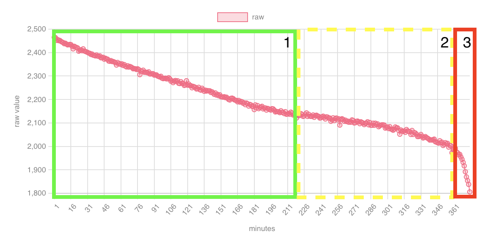
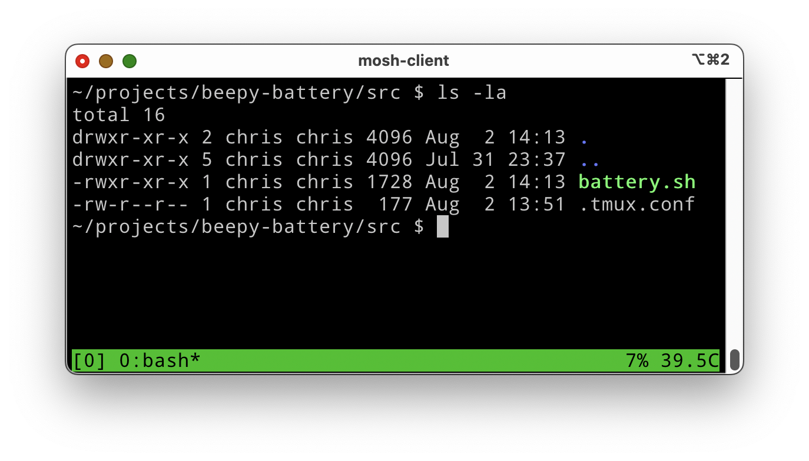

simple script to read a corrected battery percentage on the beepy / beepberry

## Motivation
While we can retrieve a value corresponding to the voltage of the beepy's battery within the system  
1) the value is unreliable, it has outliers
2) the voltage is not falling linearly when discharging, so calculating a _percentage_ by using an offset and a constant factor gives only limited information about the percentage of charge left
3) reading out the voltage every few seconds in a tmux bar at least made the I2C bus hang after a while

As a solution this script will  
* [x] do a first read out of the raw value for voltage to throw away and then a few more to average them
* [x] use (multiple?) correction factors for different levels of voltage/charge  
* [x] have a safe cutoff point to 0% so that enough charge is left to safely shut down the system
* [x] cache the result
* [ ] schedule a configurable shutdown of the system when the defined charge level is reached.

* [x] The script uses `/sys/firmware/beepberry/battery_raw` if available
* [ ] it falls back to directly reading i2c (and temporarily disconnect the keyboard) if not, so it runs on devices with original firmware and with the patched firmware (and module) by excel/ardangelo.  

* [x] The script can write a log to the user's directory.

## Measurements
This is the discharge graph of my beepy:



As you can see the beepberry runs for about 360 Minutes (375 minutes to be correct) and the raw voltage reported drops from 2465 units[^1] in the first minute to 1806 units.

The discharge seems to have three phases if we consider the raw value reported for voltage:  
1) linearly dropping
2) a phase with a little belly
3) a very steep drop at the end at about 360 minutes when the value reported is below 2000. There's about 15 minute of runtime left. This will be the 0% value for the script.

Reaching phase 3 will be considered as "battery empty" and a shutdown will be triggered. Since the battery is not really empty, there's enough time to warn the user so they can save their work and shut down the system manually.  

## Charging  
There is currently no way to query if the beepy is charging, so the percentage is just off by some unknown value while the device is plugged in.

## Triggering the script

While the script can be run manually - or it could be scheduled using cron - I gather that most people will use tmux anyways, so I suggest to simply use it in the bottom bar of your tmux configuration.

## Installation
* clone the repo somewhere  
  ```git clone https://github.com/strafplanet/beepy-battery.git ```  
* copy the tmux config to your home (or adapt your own config)  
  ```beepy-battery/src/.tmux.conf ~/```
* start tmux  
  ```tmux```

You should have a result similar to this:  



## Logging
The script writes a logfile to the path given (~/battery.log) and uses this as a cache to return the last value from.  
For calibration and curiosity purposes the logfile contains way more information than the percentage the script returns:

| TIME  | DATE  | PERCENTCALC | PERCENT | VOLTAGE | RAWCALC  | RAW  | RAWFIRST | RAWARRAY                 |
| ----- | ----- | ----------- | ------- | ------- | -------- | ---- | -------- | ------------------------ |
|       |       |             |         |         |          |      |          |                          |
| 11:47 | 03.08 | 68%         | 73%     | 3.95v   | 354      | 2284 | 2286     | 2281 2285 2283 2286 2285 | 

TIME: Time of the entry  
DATE: Date of the entry  
PERCENTCALC: Percentage calculated by the script  
PERCENT: Percentage returned by sys  
VOLTAGE: Voltage returned by sys  
RAWCALC: Raw value calculated by the script (corrected, so that 0 is the lowest expected value, may be negative!)  
RAW: Raw value averaged by the script  
RAWFIRST: First raw reading from sys - is thrown away, because I have the vague idea that it is off more often  
RAWARRAY: Multiple raw values read from sys to average over  

---
[^1]: Why don't I use proper voltage measurements like 3.7V? Because it makes no sense. We're trusting the charging controller and the battery to cut off charging at the top most level. This is something we have no influence over.    
We can measure the raw value at which the battery (or the charging controller?) cuts off the battery and while we have _some_ influence on this because we can issue a shutdown command, this does not fully turn off the system.
Calculating a voltage from the masurement is not reliable and does not give additional information the user can act on. The user needs a percentage of charge left or better the time that is left with the charge the system has left.  
Of course this script is cheating, too, but cutting off at a specific point before the discharge voltage falls steeply and considering the discharge voltage nearly linear until then seems to be accurate enough for now.
